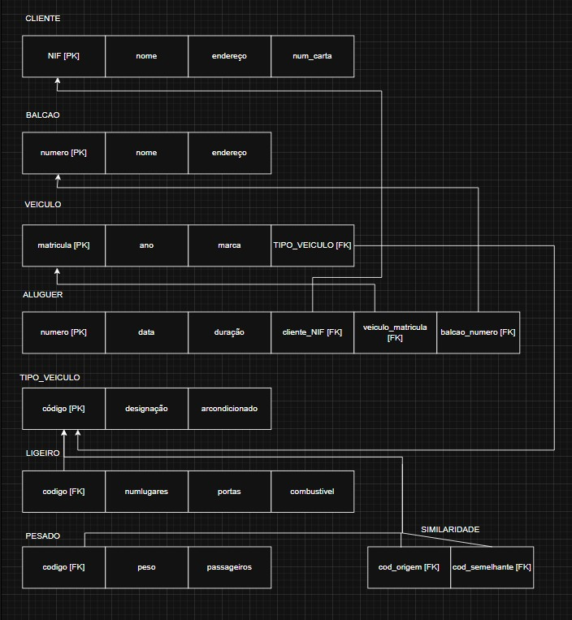
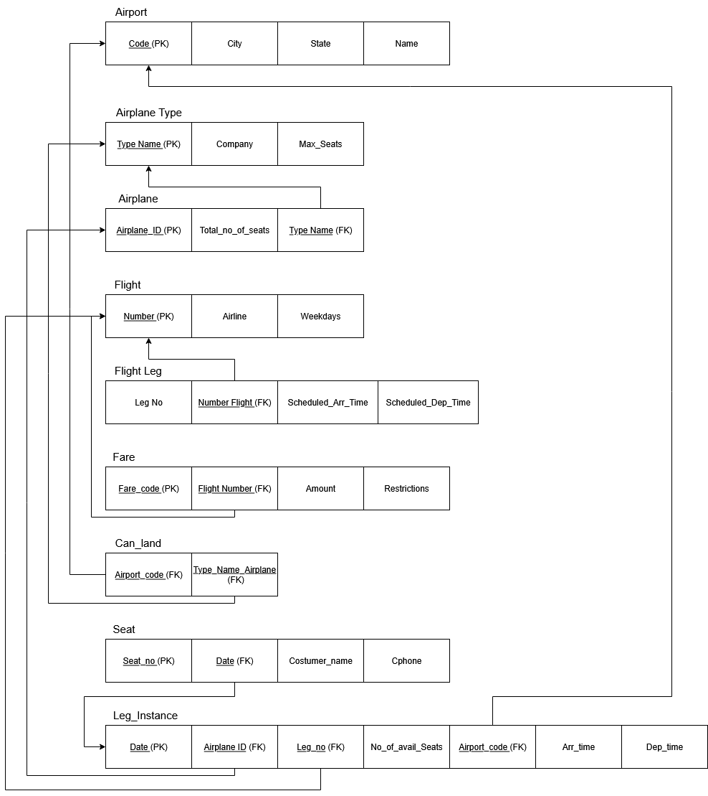
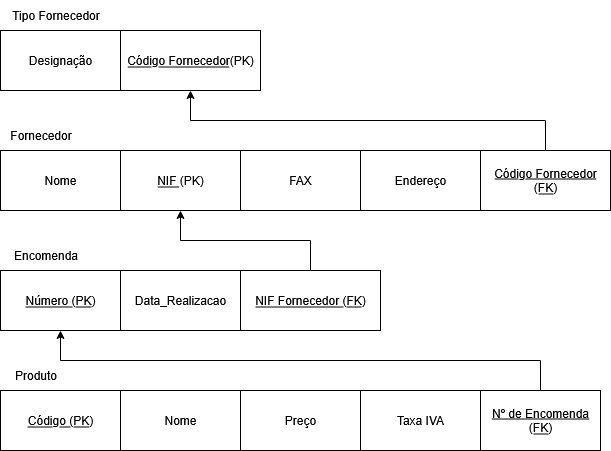
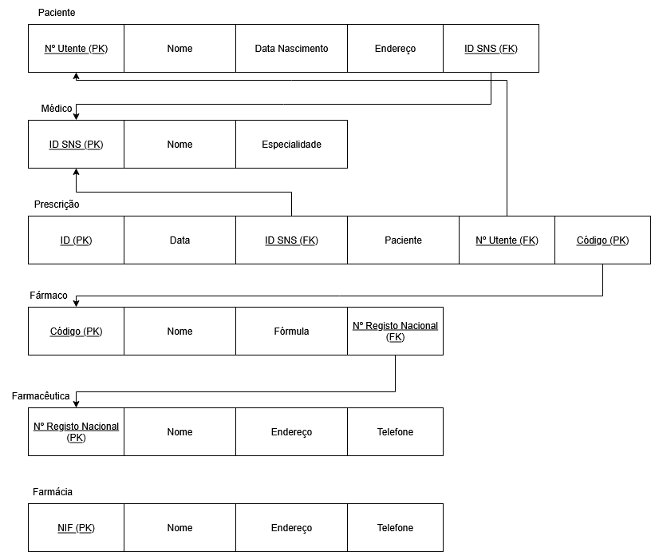
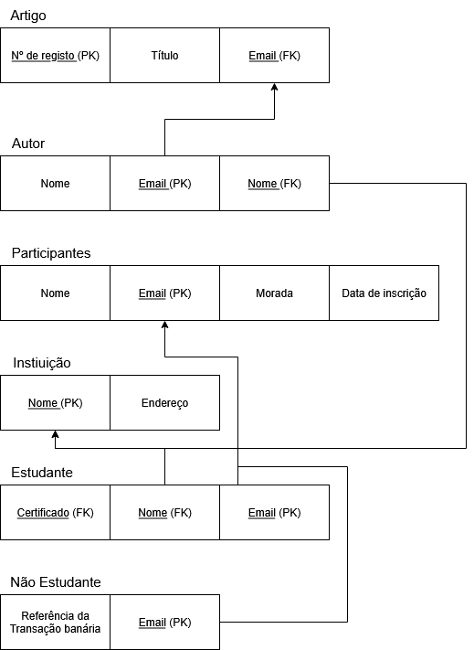
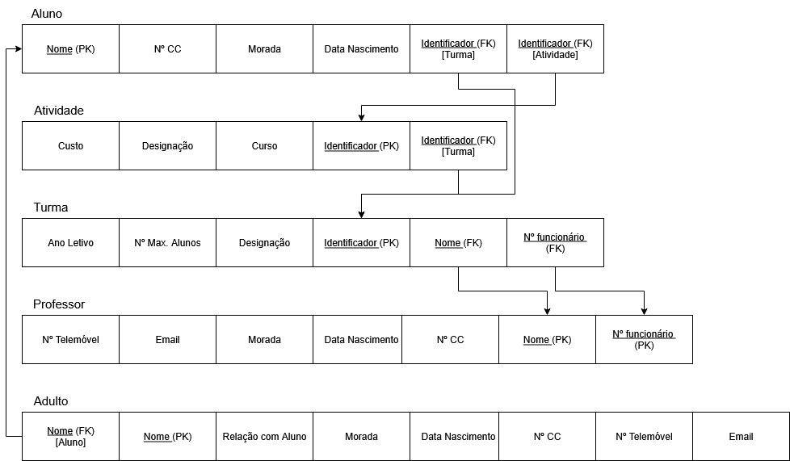

# BD: Guião 3


## ​Problema 3.1
 
### *a)*

```
r1 (Cliente) = {NIF; Nome; Endereco; Num_carta}
r2 (Balcao) = {Numero; Nome; Endereco}
r3 (Veiculo) = {Matricula; Ano; Marca; Tipo_Veiculo Codigo}
r4 (Tipo_Veiculo) = {Codigo; Designacao; Combustivel}
r5 (Ligeiro) = {Tipo_Veiculo Codigo; Portas; Passageiros, Combustível}
r6 (Pesado) = {Tipo_Veiculo Codigo; Peso; Passageiros}
r7 (Aluguer) = {Numero; Data; Duracao; Cliente NIF; Veiculo Matricula; Balcao Numero}
r8 (Similaridade) = {Tipo_Veiculo Codigo_origem; Tipo_Veiculo Codigo_semelhante}

```


### *b)* 

```
PK -> Primary Key || FK -> Foreign Key || CK -> Candidate Key

r1 (Cliente) = { PK [NIF]; CK [Nome; Endereco]}
r2 (Balcao) = { PK [Numero]; CK [Nome; Endereço] }
r3 (Veiculo) = { PK [Matricula]; FK [Codigo] }
r4 (Tipo_Veiculo) = { PK [Codigo]; CK [Designacao; Combustivel] }
r5 (Ligeiro) = { PK [Codigo]; FK [Codigo] }
r6 (Pesado) = { PK [Codigo]; FK [Codigo] }
r7 (Aluguer) = { PK [Numero]; FK [NIF; Matricula; Numero] }
r8 (Similaridade) = { FK [Codigo_origem; Codigo_semelhante] }

```


### *c)* 




## ​Problema 3.2

### *a)*

```
r1 (Airport) = {Airport_code; City; State; Name}
r2 (Airplane_Type) = {Company; Type_name; Max_seats}
r3 (Airplane) = {Airplaine_id; Total_no_of_seats; AirplaneType Type_name}
r4 (Leg_Instance) = {No_of_avail_seats; Date; Flight Leg_no; Airplane Airplane_id; Departs Dep_time; Arrives Arr_time; Airport Airport_code}
r5 (Seat) = {Seat_no; Reservation Customer_name; Reservation Cphone; Leg_Instance Date}
r6 (Fare) = {Code; Amount; Restrictions; Flight Number}
r7 (Flight) = {Weekdays; Airline; Number}
r8 (Flight_Leg) = {Leg_no; Airport Airport_Code; Departure Airport Scheduled_dep_time; Arrival Airport Scheduled_arr_time; Flight Number}
r9 (Can_Land) = { Airport Airport_code; Airport_Type Type_name}

```


### *b)* 

```
PK -> Primary Key || FK -> Foreign Key || CK -> Candidate Key

r1 (Airport) = { PK [Airport_code]; CK [City; Name] }
r2 (Airplaine_Type) = { PK [Type_name]; CK [Company; Max_seats] }
r3 (Airplaine) = { PK [Airplaine_id]; FK [Type_name] }
r4 (Leg_Instance) = { PK [Date]; FK [Leg_no; Airplane_id; Airport_code] }
r5 (Seat) = { PK [Seat_no]; FK [Date]; CK [Customer_name] }
r6 (Fare) = { PK [Code]; FK [Number] }
r7 (Flight) = { PK [Number] }
r8 (Flight_Leg) = { PK [Leg_no]; FK [Airport_Code; Number] }
r9 (Can_Land) = { FK [Airport_code; Type_name] }
```


### *c)* 




## ​Problema 3.3


### *a)* 2.1



### *b)* 2.2



### *c)* 2.3



### *d)* 2.4

